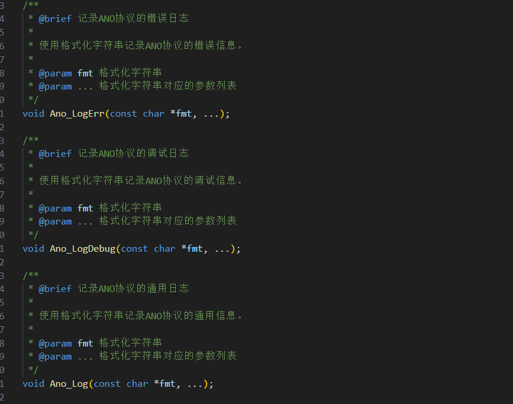
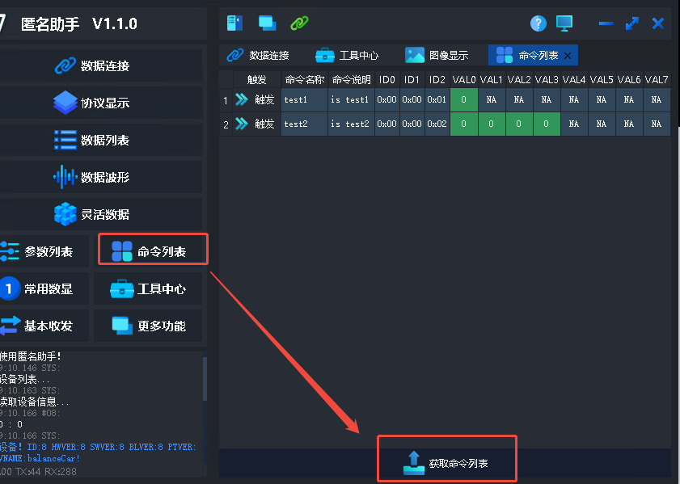
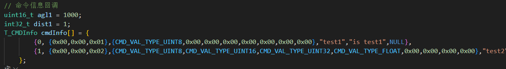
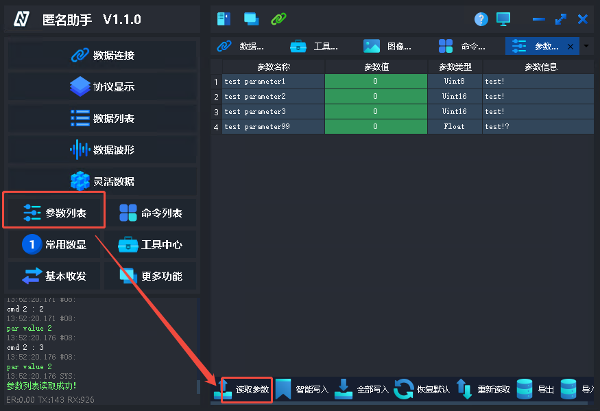
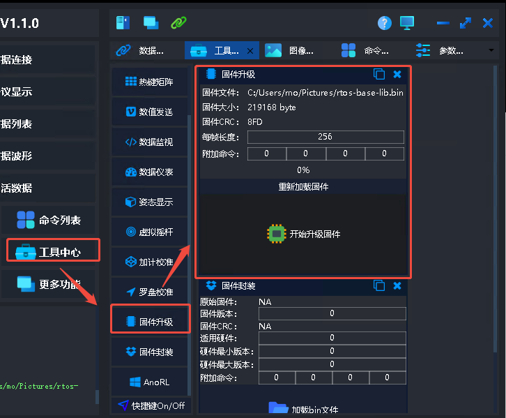

## 请耐心阅读本文档，已做出详细的使用解释  

### 编译  
在linux环境中，执行  
> mkdir build  
> cd build  
> cmake ..&&make -j8  

### 编译后使用  
编译后在文件中生成anoUdp可执行文件  
直接执行，然后打开上位机填入本机ip以及预设好的12345端口即可正常使用  

### 功能测试
#### 1.日志打印  
设置了三种日志打印模式，可以通过这三个日志打印将日志输出到匿名助手中  

#### 2.命令注册  
> 查看已注册的命令  
  
> 其中显示的可用命令与代码中注册的一致  

#### 3.参数显示  
> 查看已注册的参数  
  

#### 4.波形显示  
> 显示接收到的波形  

#### 5.升级包传输  
> 任意的bin文件都可以通过这个模块进行完整传输
